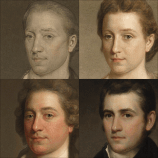

# Controllable and Compositional Generation with Latent-Space Energy-Based Models




Official PyTorch implementation of the NeurIPS 2021 paper:<br>
**[Controllable and Compositional Generation with Latent-Space Energy-Based Models](https://arxiv.org/abs/2110.10873)**
<br>
Weili Nie, Arash Vahdat, Anima Anandkumar<br>
https://nvlabs.github.io/LACE <br>

Abstract: *Controllable generation is one of the key requirements for successful adoption of deep generative models in
real-world applications, but it still remains as a great challenge. In particular, the compositional ability to generate
novel concept combinations is out of reach for most current models. In this work, we use energy-based models (EBMs) to
handle compositional generation over a set of attributes. To make them scalable to high-resolution image generation, we
introduce an EBM in the latent space of a pre-trained generative model such as StyleGAN. We propose a novel EBM
formulation representing the joint distribution of data and attributes together, and we show how sampling from it is
formulated as solving an ordinary differential equation (ODE). Given a pre-trained generator, all we need for
controllable generation is to train an attribute classifier. Sampling with ODEs is done efficiently in the latent space
and is robust to hyperparameters. Thus, our method is simple, fast to train, and efficient to sample. Experimental
results show that our method outperforms the state-of-the-art in both conditional sampling and sequential editing. In
compositional generation, our method excels at zero-shot generation of unseen attribute combinations. Also, by composing
energy functions with logical operators, this work is the first to achieve such compositionality in generating
photo-realistic images of resolution 1024x1024.*

## Requirements

- Linux and Windows are supported, but we recommend Linux for performance and compatibility reasons.
- 1 high-end NVIDIA GPU with at least 24 GB of memory. We have done all testing and development using a single NVIDIA
  V100 GPU with memory size 32 GB.
- 64-bit Python 3.8.
- CUDA=10.0 and docker must be installed first.
- Installation of the required library dependencies with Docker:
    ```bash
    docker build -f lace-cuda-10p0.Dockerfile --tag=lace-cuda-10-0:0.0.1 .
    docker run -it -d --gpus 0 --name lace --shm-size 8G -v $(pwd):/workspace -p 5001:6006 lace-cuda-10-0:0.0.1
    docker exec -it lace bash
    ```

## Experiments on CIFAR-10

The `CIFAR10` folder contains the codebase to get the main results on the CIFAR-10 dataset, where the `scripts` folder
contains the necessary bash scripts to run the code.

### Data preparation

Before running the code, you have to download the data (i.e., the latent code and label pairs) from
[here](https://drive.google.com/file/d/1K8qlHyf6IRMwFctCWBvHA2W8j3iRTgjk/view?usp=sharing)
and unzip it to the `CIFAR10` folder. Or you can go to the folder `CIFAR10/prepare_data` and follow
the [instructions](CIFAR10/prepare_data/README.md) to generate the data.

### Training

To train the latent classifier, you can run:

```bash
bash scripts/run_clf.sh
```

In the script `run_clf.sh`, the variable `x` can be specified to `w` or `z`, representing that the latent classifier is
trained in the w-space or z-space of StyleGAN, respectively.

### Sampling

To get the conditional sampling results with the ODE or Langevin dynamics (LD) sampler, you can run:

```bash
# ODE
bash scripts/run_cond_ode_sample.sh

# LD
bash scripts/run_cond_ld_sample.sh
```

By default, we set `x` to `w`, meaning we use the w-space classifier, because we find our method works the best in w-space.
You can change the value of `x` to `z` or `i` to use the classifier in z-space or pixel space, for a comparison.

To compute the conditional accuracy (ACC) and FID scores in conditional sampling with the ODE or LD sampler, you can
run:

```bash
# ODE
bash scripts/run_cond_ode_score.sh

# LD
bash scripts/run_cond_ld_score.sh
```

Note that:

1) For the ACC evaluation, you need a pre-trained image classifier, which can be downloaded as instructed
   [here](CIFAR10/prepare_data/README.md);

2) For the FID evaluation, you need to have the FID reference statistics computed beforehand. You can go to the
   folder `CIFAR10/prepare_data` and follow the [instructions](CIFAR10/prepare_data/README.md) to compute the FID
   reference statistics with real images sampled from CIFAR-10.

## Experiments on FFHQ

The `FFHQ` folder contains the codebase for getting the main results on the FFHQ dataset, where the `scripts` folder
contains the necessary bash scripts to run the code.

### Data preparation

Before running the code, you have to download the data (i.e., 10k pairs of latent variables and labels)
from [here](https://drive.google.com/file/d/1sFXqGpciLgqzjqMVCuWktH25ptLtXu_p/view?usp=sharing)
(originally from [StyleFlow](https://github.com/RameenAbdal/StyleFlow)) and unzip it to the `FFHQ` folder.

### Training

To train the latent classifier, you can run:

```bash
bash scripts/run_clf.sh
```

Note that each `att_name` (i.e., *glasses*) in `run_clf.sh`
corresponds to a separate attribute classifier.

### Sampling

First, you have to get the pre-trained StyleGAN2 (config-f) by following the instructions in
[Convert StyleGAN2 weight from official checkpoints](FFHQ/prepare_models_data/README.md).

#### Conditional sampling

To get the conditional sampling results with the ODE or LD sampler, you can run:

  ```bash
  # ODE
  bash scripts/run_cond_ode_sample.sh

  # LD
  bash scripts/run_cond_ld_sample.sh
  ```

To compute the conditional accuracy (ACC) and FID scores in conditional sampling with the ODE or LD sampler, you can
run:

```bash
# ODE
bash scripts/run_cond_ode_score.sh

# LD
bash scripts/run_cond_ld_score.sh
```

Note that:

1) For the ACC evaluation, you need to train an FFHQ image classifier, as instructed
   [here](FFHQ/prepare_models_data/README.md);

2) For the FID evaluation, you need to have the FID reference statistics computed beforehand. You can go to the
   folder `FFHQ/prepare_models_data` and follow the [instructions](FFHQ/prepare_models_data/README.md) to compute the
   FID reference statistics with the StyleGAN generated FFHQ images.

#### Sequential editing

To get the qualitative and quantitative results of sequential editing, you can run:

```bash
# User-specified sampling
bash scripts/run_seq_edit_sample.sh

# ACC and FID
bash scripts/run_seq_edit_score.sh
```

Note that:

- Similarly, you first need to train an FFHQ image classifier and get the FID reference statics to compute ACC and FID
  score by following the [instructions](FFHQ/prepare_models_data/README.md), respectively.

- To get the face identity preservation (ID) score, you first need to download the
  pre-trained [ArcFace]([ArcFace](https://github.com/TreB1eN/InsightFace_Pytorch)) network, which is publicly
  available [here](https://1drv.ms/u/s!AhMqVPD44cDOhkPsOU2S_HFpY9dC), to the folder
  `FFHQ/pretrained/metrics`.

#### Compositional Generation

To get the results of zero-shot generation on novel attribute combinations, you can run:

```bash
bash scripts/run_zero_shot.sh
```

To get the results of compositions of energy functions with logical operators, we run:

```bash
bash scripts/run_combine_energy.sh
```

## Experiments on MetFaces

The `MetFaces` folder contains the codebase for getting the main results on the MetFaces dataset, where the `scripts`
folder contains the necessary bash scripts to run the code.

### Data preparation

Before running the code, you have to download the data (i.e., 10k pairs of latent variables and labels)
from [here](https://drive.google.com/file/d/1IK_-r9jmlIHkWGl1xwAGjwpr0tY2v8vj/view?usp=sharing)
and unzip it to the `MetFaces` folder. Or you can go to the folder `MetFaces/prepare_data` and follow
the [instructions](MetFaces/prepare_data/README.md) to generate the data.

### Training

To train the latent classifier, you can run:

```bash
bash scripts/run_clf.sh
```

Note that each `att_name` (i.e., *yaw*) in `run_clf.sh`
corresponds to a separate attribute classifier.

### Sampling

To get the conditional sampling and sequential editing results, you can run:

  ```bash
  # conditional sampling
  bash scripts/run_cond_sample.sh

  # sequential editing
  bash scripts/run_seq_edit_sample.sh
  ```

## Experiments on AFHQ-Cats

The `AFHQ` folder contains the codebase for getting the main results on the AFHQ-Cats dataset, where the `scripts`
folder contains the necessary bash scripts to run the code.

### Data preparation

Before running the code, you have to download the data (i.e., 10k pairs of latent variables and labels)
from [here](https://drive.google.com/file/d/16o06KHNIp4s6aPaAb7EbVnQrpeaGDFzV/view?usp=sharing)
and unzip it to the `AFHQ` folder. Or you can go to the folder `AFHQ/prepare_data` and follow
the [instructions](AFHQ/prepare_data/README.md) to generate the data.

### Training

To train the latent classifier, you can run:

```bash
bash scripts/run_clf.sh
```

Note that each `att_name` (i.e., *breeds*) in `run_clf.sh`
corresponds to a separate attribute classifier.

### Sampling

To get the conditional sampling and sequential editing results, you can run:

  ```bash
  # conditional sampling
  bash scripts/run_cond_sample.sh

  # sequential editing
  bash scripts/run_seq_edit_sample.sh
  ```

## License

Please check the [LICENSE](LICENSE) file. This work may be used non-commercially, meaning for research or evaluation purposes only.
For business inquiries, please contact
[researchinquiries@nvidia.com](mailto:researchinquiries@nvidia.com).

## Citation

Please cite our paper, if you happen to use this codebase:

```
@inproceedings{nie2021controllable,
  title={Controllable and compositional generation with latent-space energy-based models},
  author={Nie, Weili and Vahdat, Arash and Anandkumar, Anima},
  booktitle={Neural Information Processing Systems (NeurIPS)},
  year={2021}
}
```

  


  
